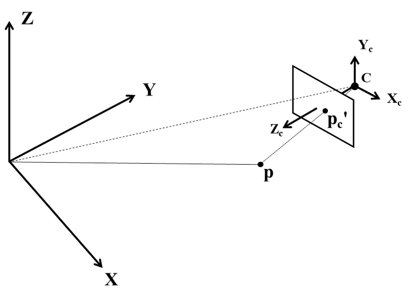
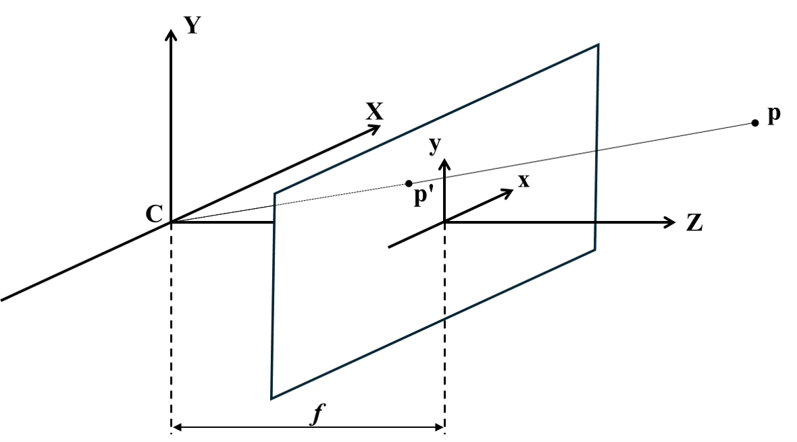

# 3D Point/Object Reconstruction 

This project implements a multi-camera system for 3D human pose estimation. Using video streams captured from several synchronized cameras, it applies YOLO pose estimation to detect 2D keypoints in each view. The detected keypoints are then reconstructed into a 3D coordinate system through geometric transformations and triangulation. The system is written in Python and leverages OpenCV for video handling and visualization, NumPy for mathematical operations and coordinate transformations, Matplotlib for 3D visualization of reconstructed poses, and threading for efficient real-time video capture. The result is a flexible framework that can be extended to tasks such as motion analysis, activity recognition, or any application requiring 3D keypoint reconstruction from multi-view video data.

## Features

- Multi-camera support – capture and process video streams from multiple cameras simultaneously.

- Real-time 2D pose estimation – use YOLO pose to extract keypoints from each video feed in real time.

- 3D reconstruction – triangulate 2D keypoints from multiple views into a consistent 3D coordinate system.

- Camera coordinate transformations – handle camera calibration and transformations between global and local frames.

- Visualization tools – display live camera streams with detected keypoints and plot the reconstructed 3D poses with Matplotlib.

- Threaded video capture – use Python threading to keep multiple video streams running smoothly.

- Extensible design – built in Python with OpenCV, NumPy, and PyTorch, making it easy to adapt for research, sports analysis, robotics, or other applications

## Mathematical Formulation

The reconstruction process is based on the pinhole camera model and the transformation between the global coordinate system and each camera’s local coordinate system.

### 1. Coordinate transformation
A 3D point in the global coordinate system $(X, Y, Z)$ is denoted by $\mathbf{p} = \begin{bmatrix} \mathit{x}, \mathit{y},   \mathit{z} \end{bmatrix}^T$.

The camera is defined by its position $\mathbf{c}$ and the view direction vector, or forward vector, $\mathbf{f}$, which is aligned with the camera’s optical axis (the camera’s local $Z_c$-axis).

The corresponding point in the camera coordinate system is obtained by translating and rotating the global point through the following homogeneous transformation:

$\begin{bmatrix} \mathbf{p}_c \\ 1 \end{bmatrix} = \begin{bmatrix} \mathbf{R} & \mathbf{t} \\ \mathbf{0}^T & 1 \end{bmatrix} \begin{bmatrix} \mathbf{p} \\ 1 \end{bmatrix}$

where  
- $\mathbf{R} \in \mathbb{R}^{3\times 3}$ is the rotation from world to camera axes,  
- $\mathbf{t} = -\mathbf{R}\mathbf{c}$ is the translation vector,  
- $\mathbf{p}_c = \begin{bmatrix} \mathit{x}_c,  \mathit{y}_c , \mathit{z}_c \end{bmatrix}^T$ are the coordinates of the point relative to the camera's coordinate system.  

This step is illustrated in the following figure (world coordinate system on the left, camera-centered axes on the right).

### 2. Pinhole projection model
In the camera coordinate system, the 3D point $\mathbf{p}_c$ is projected onto the 2D image plane at depth $f$ (the focal length). The projection is given by:

$x' = f \, \frac{x_c}{z_c}, \qquad y' = f \, \frac{y_c}{z_c},$

where $(x',y')$ are the image plane coordinates of the projection $\mathbf{p}'$.  

This is illustrated in the following figure, where the line of sight from the camera center $C$ to the 3D point $\mathbf{p}$ intersects the image plane at $\mathbf{p}'$.

### 3. 3D Reconstruction (Inverse Problem)

Once 2D keypoints are detected in multiple camera views, the goal is to reconstruct their 3D position in the global coordinate system.

The $i$-th camera maps a 3D world point $\mathbf{p} = [x, y, x]^T$ into its 2D image plane through the projection equation

$\mathbf{p}_i' = \begin{bmatrix}  x_i' \\ y_i' \end{bmatrix} = \frac{f^{(i)}}{\mathit{z}_c^{(i)}} \begin{bmatrix}  \mathit{x}_c^{(i)} \\ \mathit{y}_c^{(i)} \end{bmatrix}$  

where $\mathbf{p}_c^{(i)} = [\mathit{x}_c^{(i)}, \mathit{y}_c^{(i)}, \mathit{z}_c^{(i)}]^T$ are the coordinates of point $\mathbf{p}$ in the camera coordinate system, which are obtained from

$\begin{bmatrix} \mathbf{p}_c^{(i)} \\ 1 \end{bmatrix} = \begin{bmatrix} \mathbf{R}^{(i)} & \mathbf{t}^{(i)} \\ \mathbf{0}^T & 1 \end{bmatrix} \begin{bmatrix} \mathbf{p} \\ 1 \end{bmatrix}$.

The 2D projection equation can be rewritten as:

$\begin{bmatrix}  x_i' \\ y_i' \end{bmatrix} = \frac{f^{(i)}}{{\mathbf{r}_z^{(i)}}^T \mathbf{p}-t_z^{(i)}} \begin{bmatrix}  {\mathbf{r}_x^{(i)}}^T \mathbf{p}-t_x^{(i)}  \\ {\mathbf{r}_y^{(i)}}^T \mathbf{p}-t_y^{(i)} \end{bmatrix}$ 

where 
$\mathbf{R} = \begin{bmatrix} {\mathbf{r}_x^{(i)}}^T, {\mathbf{r}_y^{(i)}}^T, {\mathbf{r}_z^{(i)}}^T  \end{bmatrix}^T$ 
and
$\mathbf{t} = [t_x^{(i)}, t_y^{(i)}, t_z^{(i)}]^T$.

Rearranging these equations leads to the following linear system:

$\begin{bmatrix}  x_i' {\mathbf{r}_z^{(i)}} - f^{(i)} {\mathbf{r}_x^{(i)}}  \\ y_i' {\mathbf{r}_z^{(i)}} -f^{(i)} {\mathbf{r}_y^{(i)}} \end{bmatrix} \mathbf{p} = \begin{bmatrix}  x_i't_z^{(i)} - f^{(i)} t_x^{(i)}  \\  y_i' t_z^{(i)} - f^{(i)} t_y^{(i)} \end{bmatrix}$ 

By stacking the equations from multiple cameras, the system becomes overdetermined. The 3D point $\mathbf{p}$ can then be recovered by solving

$\hat{\mathbf{p}} = \arg\min_{\mathbf{p}} \|\mathbf{A}\mathbf{p} - \mathbf{b}\|_2,$

where
$\mathbf{A} = \begin{bmatrix}  x_0' {\mathbf{r}_z^{(0)}} - f^{(0)} {\mathbf{r}_x^{(0)}}  \\ y_0' {\mathbf{r}_z^{(0)}} -f^{(0)} {\mathbf{r}_y^{(0)}} \\ \vdots \\  x_n' {\mathbf{r}_z^{(n)}} - f^{(n)} {\mathbf{r}_x^{(n)}}  \\ y_n' {\mathbf{r}_z^{(n)}} -f^{(n)} {\mathbf{r}_y^{(n)}} \end{bmatrix}$ 
and 
$\mathbf{b} = \begin{bmatrix}  x_0't_z^{(0)} - f^{(0)} t_x^{(0)}  \\  y_i' t_z^{(0)} - f^{(0)} t_y^{(0)} \\ \vdots \\   x_n't_z^{(n)} - f^{(n)} t_x^{(n)}  \\  y_n' t_z^{(n)} - f^{(n)} t_y^{(n)} \end{bmatrix},$ 

which in practice reduces to solving a least-squares linear system.

## Code Structure

The project is organized into several core components that handle video capture, camera modeling, 3D reconstruction, and visualization:

### Geometry Primitives
- **`Point`** – Represents a 3D point in space. Provides methods to convert to NumPy arrays and normalize coordinates.  
- **`Projection`** – Represents a 2D projection of a 3D point onto the camera image plane.  

### Video Handling
- **`VideoStream`** – A threaded wrapper around OpenCV’s `VideoCapture`.  
  - Captures frames asynchronously for smooth multi-camera streaming.  
  - Configurable resolution per camera.  
  - Provides `get_frame()` for retrieving the latest frame.  

### Camera Model
- **`Camera`** – Defines a camera in terms of:  
  - Position in the global coordinate system.  
  - A forward/look-at vector (the camera’s local z-axis).  
  - Focal length and frame size.  
  - Computes the homogeneous transformation matrix mapping world coordinates to camera coordinates.  
  - Provides:  
    - `global_to_camera(point)` – transform a 3D global point into the camera’s local frame.  
    - `project_point(point)` – apply the pinhole projection model.  
    - `image_from_global(point)` – convenience method to directly project a world point into the image.  

### Inverse Problem
- **`InverseProblem`** – Implements the multi-view reconstruction.  
  - Builds a linear system from multiple camera projections.  
  - Solves via least-squares (`np.linalg.lstsq`) to recover the global 3D point.  
  - Provides `compute_inverse(projections)` which reconstructs a global 3D point given its 2D projections across all cameras.  

### Visualization
- **`plot_reconstruction`** – Plots reconstructed 3D points using Matplotlib.  
  - Supports coloring and optional junctions (edges) defined in `ObjectMapping` for structured visualization.  
  - Dynamically updates the 3D scene as new frames are processed.  

### Main Pipeline
1. Initialize cameras with known positions and orientations.  
2. Start threaded video capture for each camera.  
3. Load YOLO model for body or hand pose detection.  
4. Run pose estimation on each frame.  
5. Collect detected 2D keypoints, normalize coordinates, and pass them into the inverse problem solver.  
6. Reconstruct 3D positions of keypoints.  
7. Plot the reconstruction in real time.  

## Limitations
- Assumes camera positions and orientations are known in advance.  
- Reconstruction accuracy depends on calibration and synchronization between cameras.  
- Real-time performance depends on hardware (YOLO inference speed and number of cameras).  
- Currently supports reconstruction of a single object.  

## Future Work
- Add support for reconstruction of multiple objects.
- Improve handling of occlusion and missing keypoints.  
- Enable saving or exporting 3D reconstructions for offline analysis.
- Explore additional applications such as sports analytics, gesture recognition, or robotics.  